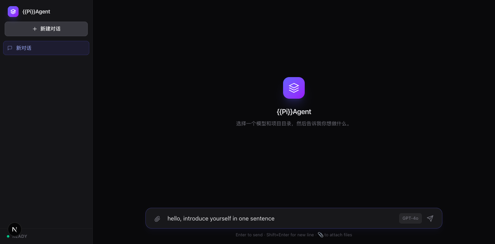

# Agent Chat UI 🤖 / AI Agent 聊天界面

精美、现代化的 AI Agent 聊天界面 —— 基于 Next.js 14、TypeScript 和 Tailwind CSS 构建。

> A beautiful, modern chat interface for AI agents. Built with Next.js 14, TypeScript, and Tailwind CSS.



## ✨ 功能 Features

- **流式对话 Streaming Chat** — 逐 token 实时流式响应，基于 Server-Sent Events (SSE)
- **工具调用可视化 Tool Call Visualization** — 可展开的工具调用卡片，显示参数和返回结果
- **多模型支持 Multi-Model** — 兼容任何 OpenAI 格式 API（OpenAI、Anthropic、DeepSeek、Ollama、Groq 等）
- **Markdown 渲染** — 支持 GFM 语法高亮、代码块、表格
- **对话管理 Conversation Management** — 创建、切换、删除对话，localStorage 本地存储
- **暗色模式 Dark Mode** — 跟随系统明暗主题
- **响应式设计 Responsive** — 桌面端 + 移动端适配

## 🚀 快速开始 Quick Start

```bash
git clone https://github.com/TeddyBobby/agent-chat-ui.git
cd agent-chat-ui
npm install
npm run dev
```

打开 http://localhost:3000，点击 ⚙️ 设置图标输入 API Key。

> Open http://localhost:3000, click the ⚙️ settings icon to enter your API key.

## 🔧 配置 Configuration

| 环境变量 Env | 说明 Description |
|-------------|-----------------|
| `OPENAI_API_KEY` | API 密钥（也可在界面中输入） |
| `OPENAI_BASE_URL` | 自定义 API 地址（默认 `https://api.openai.com/v1`） |

### 使用本地模型 (Ollama)

1. 启动 Ollama：`ollama serve`
2. Base URL 填 `http://localhost:11434/v1`
3. Model 填本地模型名（如 `gemma3`、`llama3`）
4. API Key 填任意非空字符串（如 `ollama`）

## 🏗️ 技术栈 Tech Stack

| 层 Layer | 技术 Technology |
|----------|---------------|
| 框架 Framework | [Next.js 14](https://nextjs.org/) (App Router) |
| 语言 Language | [TypeScript](https://www.typescriptlang.org/) |
| 样式 Styling | [Tailwind CSS](https://tailwindcss.com/) |
| Markdown | [react-markdown](https://github.com/remarkjs/react-markdown) + remark-gfm |
| 流式 Streaming | Server-Sent Events (SSE) |
| 图标 Icons | 内联 SVG（零图标库依赖） |

## 🤝 贡献 Contributing

欢迎 PR！大改动请先开 issue 讨论。

> PRs welcome! For major changes, please open an issue first.

## 📄 许可 License

MIT © [TeddyBobby](https://github.com/TeddyBobby)
